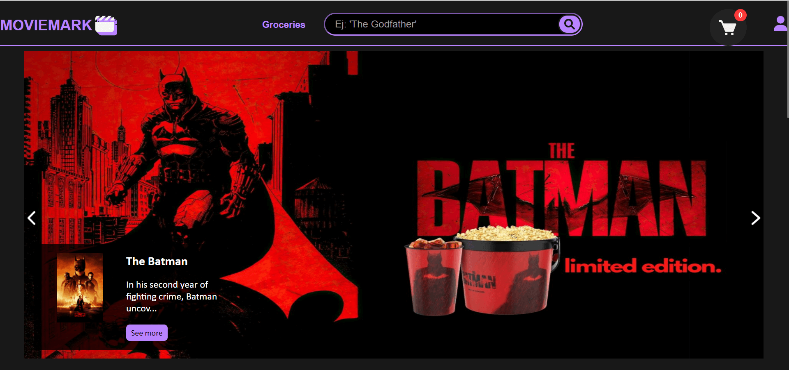
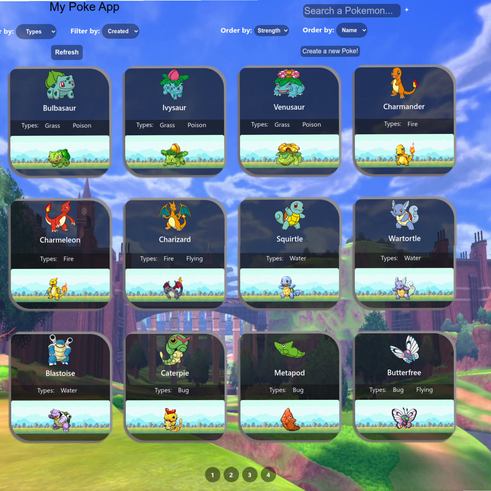
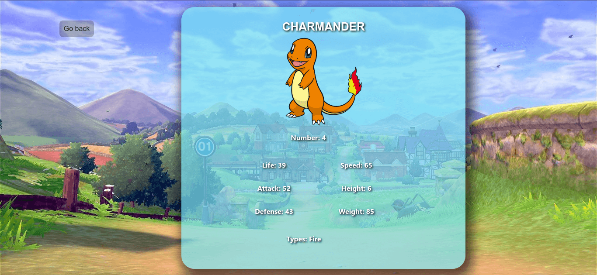

 
 <h1 align="center">  ¡Me alegro de verte!, soy Nacarith Sequera, Programadora web Full Stack. </h1>
 
 

 

### Acerca de mí:

* 
 Soy una apasionada programadora web Full Stack, graduada como Técnico Superior Universitario en Informática, con experiencia en Front-end y Back-end. He participado en proyectos de desarrollo aplicando tecnologías como: JavaScript, ReactJS/Redux, NodeJS, Express, PostgreSQL, MongoDB, Docker y Git. Colaboré en un proyecto grupal, donde logré ejercitar mis capacidades sociales y técnicas, haciendo uso de la metodología ágil Scrum. Me destaco por ser una persona con habilidades blandas como la comunicación, la escucha activa y el trabajo en equipo.

 

<h3 align="center">📂 Últimos proyectos:</h3>

<tr>
<td>

</td>
<td> <h4 align="left"> <a href="https://github.com/nacalej/star_wars_upskilling" target="_blank"><code>📂 Star wars - Microservicios.</code></a> </h4>
  
  
Proyecto individual desarrollado durante el curso Upskilling Back End del Bootcamp Henry, con el propósito de implementar una plataforma de microservicios básica.
   El proyecto está conformado por 5 servicios pequeños, autónomos e interconectados utilizando peticiones HTTP. Cada microservicio permite crear, obtener, actualizar y eliminar información sobre personajes, planetas y películas de la saga Star wars a través del microservicio Gateway como punto de entrada, a su vez, el microservicio de base de datos gestiona la conexión enviando y recuperando información desde y hacia la base de datos.

 Tecnologías utilizadas para el desarrollo:
- Back End: NodeJS (Express), Mongoose.
- Base de datos: MongoDB.
- Herramientas: Docker, Docker Compose.
 

  
Link del repo: <a href="https://github.com/nacalej/star_wars_upskilling"> Star wars </a>

  </td>
</tr>
<!-- <tr> -->
<!-- <td> -->

<tr>
<td>

</td>

<tr>
<td>

</td>
<td> <h4 align="left"> <a href="https://www.youtube.com/watch?v=j1T8vVoPyCU&ab_channel=NacarithSequera" target="_blank"><code>📂 Movie Mark - Ecommerce.</code></a> </h4>
  
  
Aplicación que tenía como objetivo, agilizar la
compra de tickets y golosinas, previo a asistir
al cine. Participación en un equipo de desarrollo ágil utilizando Scrum, con reuniones diarias con nuestro Project Manager y sprints semanales con nuestro Product Owner, para presentar los avances del desarrollo. Diseño y creación de la interfaz para visualizar películas en estreno y mejor calificadas. Autenticación y registro de usuarios, para realizar el pago del pedido (boletos y golosinas)  a través de MercadoPago.

 Tecnologías utilizadas para el desarrollo:
- Front End: ReactJS, Redux, SASS.
- Back End: NodeJS (Express), Sequelize.
- Base de datos: PostgreSQL.
- Herramientas: Git, GitHub, Trello, Slack.
- Agile: Scrum.
 

  
Link del repo: <a href="https://github.com/CandelaPedelhez/Moviemark"> Movie Mark </a>

  

   

     
     
  

 

  </td>
</tr>
<!-- <tr> -->
<!-- <td> -->

<tr>
<td>

</td>
<td> <h4 align="left"> <code>📂 Pokémon App.</code> </h4>
  
Diseño y desarrollo de una SPA (Single-Page Application) para listar los pokémones tanto los que son consumidos de la API: https://pokeapi.co/, como los que existen en la base de datos, permitiendo paginar los resultados, buscar por nombre, filtrar por tipo de Pokémon, ordenar por fuerza ascendente-descendentemente y ordenar alfabéticamente.

  Tecnologías utilizadas para el desarrollo:
- Front End: ReactJS, Redux, CSS.
- Back End: NodeJS (Express), Sequelize.
- Base de datos: PostgreSQL.
- Herramientas: Git, GitHub.
 

  <!-- 
Link del repo: <a href="https://github.com/CandelaPedelhez/Moviemark"> Movie Mark </a>
 -->

  

   

     
     
  

 

 </td>
</tr>

<h2 width="100%">❤ Pasatiempos: </h2>
<ul>
  <li>Entrenar 💪🏽🏋🏽‍♀️</li>
   <li>Tejer 🧶</li>
  <li>Jugar videojuegos 🎮</li>
  <li>Senderismo 🥾</li>
  <li>Escuchar música 📻🎶❤️</li>
</ul>

## Contacto
- Email: nacariths@gmail.com
- [@nacalejs](https://twitter.com/nacalejs) en Twitter
- [Nacarith Sequera](https://www.linkedin.com/in/nacarith-sequera/ "Enlace a mi perfil de Linkedin") en Linkedin

